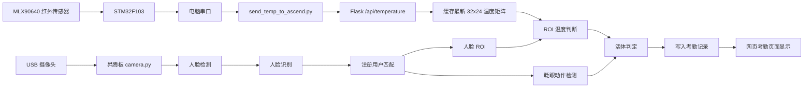

# 人脸识别 + 红外温度图像处理 + 眨眼活体检测考勤系统项目报告

## 1. 项目概述

本项目基于昇腾开发板、USB 摄像头、STM32F103 控制器以及 MLX90640 红外热成像传感器，实现了一套面向考勤场景的人脸识别与活体检测系统。系统通过摄像头完成可见光人脸采集与识别，通过 MLX90640 获取 32 × 24 红外温度矩阵，并结合眨眼动作检测判断当前识别对象是否为真实活体，从而降低照片、手机屏幕、静态头像以及单纯热源伪造带来的误识别风险。

系统最终实现了以下能力：

- 摄像头实时视频采集与网页视频流显示；
- 基于昇腾模型的人脸检测与人脸识别；
- 用户注册、用户删除、用户列表展示与编号自动排序；
- STM32F103 串口输出 MLX90640 32 × 24 温度阵列；
- Windows 端 Python 脚本读取串口温度矩阵并发送到昇腾板；
- 昇腾板 Flask 服务接收并缓存最新红外温度帧；
- 根据摄像头人脸 ROI 映射到红外温度矩阵区域；
- 基于人脸 ROI 温度特征进行红外活体判断；
- 基于眨眼动作进行动作活体检测；
- 结合“人脸识别 + 红外温度 ROI + 眨眼检测”完成考勤；
- 考勤记录展示、删除与重复测试支持。

本项目的核心目标不是单纯完成“能识别人脸”，而是在实际测试中尽可能减少照片、手机屏幕、移动图片和普通热源对考勤系统的攻击。

---

## 2. 项目背景与需求分析

传统人脸识别考勤系统通常只依赖摄像头图像进行人脸检测和特征比对。这种方案实现简单，但在安全性上存在明显问题：如果攻击者使用注册用户照片、手机屏幕显示头像，甚至配合人体温度附近的热源，普通人脸识别系统可能会误判为真实用户。

为提升系统可靠性，本项目在已有昇腾人脸识别系统基础上加入红外温度图像处理和眨眼动作活体检测。

项目需求主要包括：

1. **人脸识别**
   - 能够注册用户照片；
   - 能够在摄像头画面中检测人脸；
   - 能够与已注册用户进行特征匹配；
   - 能够在匹配成功后触发考勤逻辑。

2. **红外温度检测**
   - 使用 MLX90640 输出 32 × 24 温度矩阵；
   - 使用 STM32F103 将温度矩阵通过串口发送到电脑；
   - Windows 端脚本读取完整 768 个温度点；
   - 将温度帧发送到昇腾板 Flask 接口；
   - 昇腾板缓存最新温度矩阵；
   - 根据人脸 ROI 选择对应温度区域进行判断。

3. **活体检测**
   - 不能只用全局温度判断活体；
   - 不能只用“画面移动”判断活体；
   - 手机屏幕、移动照片、热水壶等普通热源不能轻易通过；
   - 必须结合人脸区域温度和眨眼动作；
   - 识别成功后才进入活体检测和考勤逻辑。

4. **系统交互**
   - 用户管理页面可添加、删除用户；
   - 用户删除后显示编号从 1 自动重新排序；
   - 考勤页面可显示摄像头画面；
   - 考勤记录可删除，方便反复测试；
   - 系统运行日志能够输出识别结果、温度判断结果和活体状态。

---

## 3. 系统总体架构

系统由四个主要部分组成：

1. **前端网页**
   - 用户管理页面；
   - 考勤页面；
   - 摄像头视频流显示；
   - 用户注册与考勤记录管理。

2. **昇腾板后端**
   - Flask Web 服务；
   - 摄像头视频流接口；
   - 用户管理 API；
   - 考勤记录 API；
   - 温度数据接收 API；
   - 人脸识别与活体检测调度。

3. **人脸识别与摄像头模块**
   - 摄像头设备打开；
   - 视频帧读取；
   - 人脸检测；
   - 人脸特征提取；
   - 用户特征匹配；
   - 眨眼动作检测；
   - 考勤触发。

4. **红外温度采集模块**
   - STM32F103 读取 MLX90640；
   - 串口输出 32 × 24 温度矩阵；
   - Windows Python 脚本读取串口；
   - 解析完整温度帧；
   - HTTP POST 发送到昇腾板；
   - 昇腾板缓存最新温度矩阵；
   - 根据人脸 ROI 进行区域温度判断。

系统整体数据流程如下：



---

## 4. 硬件组成

### 4.1 昇腾开发板

昇腾开发板负责运行人脸识别模型、Flask 服务、摄像头读取和活体检测逻辑。系统主程序运行目录为：

```text
/home/HwHiAiUser/workplace/Ascend310-main/Ascend310-main/samples/case1
```

主程序启动方式：

```bash
python3 app.py
```

Flask 服务监听：

```text
0.0.0.0:5000
```

当前板子 IP：

```text
10.148.111.242
```

浏览器访问地址：

```text
http://10.148.111.242:5000
```

### 4.2 USB 摄像头

摄像头用于采集可见光人脸图像。前期测试发现有效摄像头设备为：

```text
/dev/video2
```

系统中摄像头打开逻辑采用多设备尝试方式，优先尝试 `/dev/video2`，并兼容 `/dev/video0`、`/dev/video1`、`/dev/video3`。

### 4.3 MLX90640 红外热成像传感器

MLX90640 输出 32 × 24 温度矩阵，共 768 个温度点。其特点是：

- 分辨率较低；
- 适合获取人体热区分布；
- 不适合精确匹配五官细节；
- 需要与摄像头画面进行大致空间对应。

### 4.4 STM32F103 控制器

STM32F103 负责读取 MLX90640 温度数据，并通过串口输出到电脑。电脑端接收到的是每帧 24 行、每行 32 个温度点的数据。

### 4.5 Windows 电脑

Windows 电脑运行 `send_temp_to_ascend.py`，负责：

- 打开 STM32 串口；
- 读取温度矩阵；
- 解析完整 768 点温度帧；
- 计算温度统计值；
- 将最新温度帧发送到昇腾板接口。

---

## 5. 软件模块设计

### 5.1 `app.py`

`app.py` 是 Flask 主程序，承担系统 Web 服务和 API 调度功能。

主要职责：

- 初始化数据库；
- 初始化人脸识别系统；
- 初始化摄像头；
- 提供首页、用户管理页、考勤页；
- 提供用户增删改查 API；
- 提供考勤记录查询与删除 API；
- 提供视频流接口 `/video_feed`；
- 提供温度数据接收接口 `/api/temperature`；
- 缓存最新红外温度矩阵；
- 提供人脸 ROI 温度活体判断函数。

核心接口包括：

```text
GET  /
GET  /users_page
GET  /attendance_page
GET  /video_feed
GET  /api/users
POST /api/users
PUT  /api/users/<user_id>
DELETE /api/users/<user_id>
GET  /api/attendance
DELETE /api/attendance/<attendance_id>
POST /api/temperature
```

### 5.2 `camera.py`

`camera.py` 是摄像头和人脸识别核心模块。

主要职责：

- 打开摄像头；
- 读取实时视频帧；
- 将摄像头采集线程与识别线程分离，避免视频卡顿；
- 调用昇腾模型进行人脸检测；
- 提取人脸特征；
- 与数据库中注册用户特征进行比对；
- 判断识别相似度是否超过阈值；
- 调用温度 ROI 判断；
- 调用眨眼活体检测；
- 活体通过后写入考勤记录；
- 控制重复考勤冷却时间。

当前人脸识别流程为：

```text
读取摄像头帧
    ↓
检测人脸
    ↓
提取人脸特征
    ↓
与注册用户特征比对
    ↓
相似度超过阈值
    ↓
获取人脸框 ROI
    ↓
判断 ROI 温度是否符合活体特征
    ↓
判断是否完成眨眼动作
    ↓
写入考勤记录
```

### 5.3 `database.py`

`database.py` 负责 SQLite 数据库操作。

主要数据表：

1. **用户表**
   - 用户真实 ID；
   - 用户姓名；
   - 注册照片路径；
   - 人脸特征数据。

2. **考勤表**
   - 考勤记录 ID；
   - 用户 ID；
   - 考勤类型；
   - 打卡时间；
   - 图片来源；
   - 温度信息。

系统中用户管理页面显示的编号不是数据库真实 ID，而是根据当前用户列表动态生成的显示序号。这样删除用户后，页面编号可以重新从 1 开始排列，同时不破坏数据库主键关系。

### 5.4 `send_temp_to_ascend.py`

`send_temp_to_ascend.py` 运行在 Windows 电脑上，负责把红外温度矩阵发送到昇腾板。

主要功能：

- 自动或指定打开串口；
- 读取 STM32 输出的温度数据；
- 支持每行 32 个温度点的矩阵格式；
- 累计 24 行形成一帧完整 32 × 24 温度矩阵；
- 统计当前帧 `min`、`avg`、`max`、`p90` 等指标；
- 将完整矩阵通过 HTTP POST 发送到昇腾板；
- 只发送最新帧，避免旧帧堆积导致延迟。

目标接口：

```text
http://10.148.111.242:5000/api/temperature
```

---

## 6. 红外温度图像处理设计

### 6.1 温度矩阵格式

MLX90640 每帧输出：

```text
32 × 24 = 768 个温度点
```

在程序中按二维矩阵处理：

```text
24 行 × 32 列
```

每个点表示该方向上的红外测温结果。

### 6.2 温度帧接收

Windows 端脚本接收到完整 768 点后，将其打包为 JSON 发送给昇腾板。

发送数据中包含：

- 完整温度矩阵；
- 当前帧编号；
- 最小温度；
- 平均温度；
- 最大温度；
- p90 温度；
- 发送时间；
- 数据点数量。

昇腾板收到后不会立即判定活体，而是只缓存最新温度帧。

这是因为活体判断必须依赖当前识别到的人脸 ROI。单独温度帧无法判断热源是不是对应摄像头中的人脸。

因此 `/api/temperature` 返回中出现：

```text
live=False
reason=frame stored; liveness waits for matched face ROI
```

这是正常现象，表示温度数据已保存，等待摄像头识别到人脸后再判断。

### 6.3 人脸 ROI 温度判断

系统不会直接使用整张 32 × 24 温度矩阵判断活体，而是根据摄像头检测到的人脸框，将人脸位置映射到红外矩阵中的对应区域。

当前映射方式包括：

1. **粗略比例映射**
   - 摄像头和红外传感器没有严格标定时使用；
   - 根据摄像头画面宽高与 32 × 24 红外矩阵宽高进行比例换算；
   - 得到人脸中心对应的红外矩阵坐标。

2. **标定映射预留**
   - 如果后续增加 `thermal_calibration.json`；
   - 可以使用单应性矩阵或标定点完成更精确映射。

ROI 判断流程：

```text
摄像头人脸框
    ↓
取人脸中心点
    ↓
映射到 32 × 24 温度矩阵
    ↓
以映射点为中心截取局部 ROI
    ↓
计算 ROI p90、hot_points、ambient、delta
    ↓
判断是否为人体热区
```

### 6.4 温度判断指标

系统中不是简单判断“超过 30℃ 就是活体”，而是综合多个指标：

- `temperature`：ROI 中代表性温度；
- `ambient`：环境背景温度；
- `roi_p90`：ROI 内第 90 百分位温度；
- `roi_delta`：ROI 温度相对环境温度的抬升；
- `hot_points`：ROI 内达到温度条件的点数量；
- `age_ms`：温度帧距离当前判断的时间差；
- `reason`：温度判断结果说明。

典型通过日志：

```text
Face ROI thermal: roi_live=True,
map=rough_scale_no_calibration,
mapped=(17,13),
thermal_center=(15,16),
ambient=26.53,
p90=34.29,
delta=7.75,
hot_points=9,
age=41ms,
reason=roi liveness passed
```

该日志说明：

- 人脸 ROI 成功映射到红外矩阵；
- ROI 温度明显高于环境；
- 热点数量满足要求；
- 温度帧足够新；
- 红外活体判断通过。

---

## 7. 眨眼活体检测设计

### 7.1 为什么不能只用移动检测

早期方案曾尝试使用：

```text
人脸框移动 + 热区同步移动
```

作为活体判断依据。

实际测试发现，这种方法存在明显漏洞：

- 手机屏幕显示头像并移动，也会产生人脸框移动；
- 热源与手机同步移动，也可能让热区移动；
- 照片移动同样会造成画面变化；
- 移动本身不能证明对象是真人。

因此最终系统取消了“移动即活体”的判断方式。

当前逻辑中：

```text
移动不作为活体通过条件
```

活体必须依赖更强的动作特征。

### 7.2 眨眼检测原理

眨眼检测基于人脸上半部分的眼睛区域变化。

基本思路：

1. 从摄像头检测到的人脸框中截取人脸图像；
2. 取人脸上半部分作为眼睛检测区域；
3. 使用 OpenCV Haar 眼睛检测器判断眼睛状态；
4. 记录一段时间内眼睛状态变化；
5. 检测到符合眨眼模式后，认为动作活体通过。

眨眼检测目标不是识别复杂表情，而是判断当前对象是否能完成真实人脸动作。

### 7.3 活体动作流程

当前最终可用流程为：

```text
识别到注册用户
    ↓
红外 ROI 温度通过
    ↓
提示用户眨眼
    ↓
检测眼睛状态变化
    ↓
眨眼动作通过
    ↓
允许考勤
```

系统日志示例：

```text
Face matched: user=zjf, id=50, similarity=0.56
Face ROI thermal: roi_live=True, reason=roi liveness passed
Action liveness passed: blink passed
```

这说明：

- 人脸识别已经匹配到用户；
- 红外 ROI 判断通过；
- 眨眼动作检测通过；
- 系统允许进入考勤写入流程。

### 7.4 与红外温度的组合

眨眼检测单独使用仍有风险，例如播放眨眼视频可能欺骗摄像头。红外温度检测单独使用也有风险，例如热水壶、手机发热、其他热源可能造成误判。

因此系统采用组合条件：

```text
人脸识别成功 AND 红外 ROI 温度通过 AND 眨眼动作通过
```

只有三个条件同时满足，才允许写入考勤。

---

## 8. 考勤逻辑设计

### 8.1 考勤触发条件

系统写入考勤记录前必须满足：

1. 摄像头成功读取画面；
2. 检测到人脸；
3. 人脸特征与注册用户匹配；
4. 相似度达到设定阈值；
5. 当前用户未处于重复考勤冷却时间内；
6. 红外人脸 ROI 温度判断通过；
7. 眨眼活体检测通过。

满足以上条件后，系统写入考勤记录。

### 8.2 防重复考勤

为了避免同一用户站在摄像头前连续触发多条考勤记录，系统加入冷却机制。

同一用户在短时间内重复识别时，不会连续写入多条记录。

同时，为方便测试，考勤页面支持删除考勤记录。删除后可以再次进行考勤测试。

### 8.3 考勤记录字段

考勤记录中可包含：

- 用户 ID；
- 用户名；
- 考勤时间；
- 考勤类型；
- 图像来源；
- 温度信息；
- 活体检测结果。

---

## 9. 用户管理设计

### 9.1 用户注册

用户注册流程：

```text
填写用户名
    ↓
上传注册照片
    ↓
系统检测照片中的人脸
    ↓
提取人脸特征
    ↓
保存用户信息和特征
```

注册照片质量会直接影响后续识别效果。建议注册时满足：

- 人脸正对摄像头；
- 光照稳定；
- 不要严重遮挡；
- 照片中最好只有一个人脸；
- 人脸大小适中；
- 图像不要过度模糊。

### 9.2 用户删除

用户管理页面支持删除用户。

数据库中的真实 ID 不强制重排，因为数据库主键重排可能影响历史记录和数据关联。

页面显示 ID 使用动态序号：

```text
1, 2, 3, 4 ...
```

这样删除用户后，页面显示编号仍然从 1 开始排列，同时保证数据库结构稳定。

---

## 10. 前端页面设计

### 10.1 用户管理页面

用户管理页面主要功能：

- 查看用户列表；
- 添加新用户；
- 上传注册照片；
- 删除用户；
- 显示重新排序后的页面编号。

### 10.2 考勤页面

考勤页面主要功能：

- 显示实时摄像头视频流；
- 展示自动考勤结果；
- 展示历史考勤记录；
- 支持删除考勤记录；
- 方便反复进行注册和活体测试。

### 10.3 视频流接口

视频流接口：

```text
GET /video_feed
```

视频流采用 MJPEG 方式输出。为了减少摄像头卡顿，系统将摄像头采集与识别处理分离：

- 采集线程持续读取摄像头；
- 识别线程按一定间隔处理最新帧；
- 网页视频流只负责输出缓存帧；
- 避免模型推理阻塞摄像头读取。

---

## 11. 通信接口设计

### 11.1 温度数据接口

接口地址：

```text
POST /api/temperature
```

请求来源：

```text
Windows 端 send_temp_to_ascend.py
```

接口功能：

- 接收完整 32 × 24 温度矩阵；
- 校验数据点数量；
- 计算或接收统计信息；
- 缓存最新温度帧；
- 返回保存状态。

该接口不直接输出最终活体结果。因为最终活体判断必须在人脸识别成功后，根据当前人脸 ROI 进行。

### 11.2 视频流接口

接口地址：

```text
GET /video_feed
```

返回：

```text
multipart/x-mixed-replace MJPEG 视频流
```

### 11.3 用户接口

用户相关接口：

```text
GET    /api/users
POST   /api/users
PUT    /api/users/<user_id>
DELETE /api/users/<user_id>
```

### 11.4 考勤接口

考勤相关接口：

```text
GET    /api/attendance
DELETE /api/attendance/<attendance_id>
POST   /api/clockin
```

---

## 12. 系统运行流程

### 12.1 启动昇腾板服务

进入项目目录：

```bash
cd /home/HwHiAiUser/workplace/Ascend310-main/Ascend310-main/samples/case1
```

启动服务：

```bash
python3 app.py
```

正常启动后应看到：

```text
Running on http://127.0.0.1:5000
Running on http://10.148.111.242:5000
```

### 12.2 启动温度发送脚本

在 Windows 电脑运行：

```powershell
python C:\Users\fufu\Desktop\send_temp_to_ascend.py
```

正常日志示例：

```text
收到矩阵行: 32 点，当前累计 768/768
完整温度帧: min=26.30, avg=30.02, max=34.07, p90=31.61
发送最新帧 #52 成功: age=35ms
```

如果返回：

```text
reason=frame stored; liveness waits for matched face ROI
```

说明温度帧已经成功发送并缓存，系统正在等待摄像头识别到人脸后进行 ROI 活体判断。

### 12.3 访问网页

浏览器访问：

```text
http://10.148.111.242:5000
```

用户管理页面：

```text
http://10.148.111.242:5000/users_page
```

考勤页面：

```text
http://10.148.111.242:5000/attendance_page
```

### 12.4 完成考勤

完整考勤过程：

```text
摄像头识别人脸
    ↓
匹配注册用户
    ↓
读取最新红外温度矩阵
    ↓
根据人脸框映射红外 ROI
    ↓
温度 ROI 判断通过
    ↓
用户完成眨眼动作
    ↓
写入考勤记录
```

---

## 13. 测试过程与问题解决

### 13.1 摄像头打不开

问题表现：

```text
摄像头无法打开
```

排查过程：

- 使用 OpenCV 遍历 `/dev/video0` 到 `/dev/video3`；
- 发现 `/dev/video2` 能够正常读取画面；
- 原代码默认打开 `/dev/video0`，导致摄像头不可用。

解决方式：

- 修改摄像头初始化逻辑；
- 优先尝试 `/dev/video2`；
- 同时兼容其他视频设备编号。

### 13.2 网站打不开

问题表现：

```text
Flask 已启动，但浏览器访问失败
```

解决方式：

- 确认 Flask 使用 `host='0.0.0.0'`；
- 确认访问板子 IP `10.148.111.242`；
- 确认 Windows 与昇腾板在同一网络；
- 使用 `http://10.148.111.242:5000` 访问。

### 13.3 数据库只读

问题表现：

```text
sqlite3.OperationalError: attempt to write a readonly database
```

原因：

- 数据库文件或目录权限不足；
- 当前运行用户没有写权限。

解决方式：

- 调整数据库文件和目录权限；
- 或使用具备权限的用户运行服务。

### 13.4 用户删除后编号不从 1 开始

原因：

- 数据库主键 ID 自增后不会自动重排；
- 删除记录后真实 ID 保留空缺。

解决方式：

- 保留数据库真实 ID；
- 前端显示时增加动态序号 `seq`；
- 用户页面显示 `seq` 而不是数据库真实 ID。

### 13.5 注册照片后识别不出对应人物

可能原因：

- 注册照片质量低；
- 人脸特征提取不稳定；
- 相似度阈值设置不合适；
- 摄像头现场光照与注册照片差异大；
- 人脸角度差异较大。

优化方式：

- 使用清晰正脸照片注册；
- 调整识别阈值；
- 保证摄像头画面光照稳定；
- 尽量让现场人脸角度接近注册照片。

### 13.6 温度数据无法发送到昇腾板

问题原因：

- Windows 脚本目标 IP 配置错误；
- Flask 服务未启动；
- 网络不通；
- 发送接口地址错误。

解决方式：

- 将目标地址设置为：

```text
http://10.148.111.242:5000/api/temperature
```

### 13.7 温度一直显示 `live=False`

现象：

```text
live=False, reason=frame stored; liveness waits for matched face ROI
```

解释：

这不是错误。该状态表示昇腾板已经收到温度帧，但还没有进入人脸 ROI 活体判断。

最终活体结果必须等摄像头识别到人脸后才能判断。

### 13.8 温度通过但仍然不能考勤

问题日志：

```text
Face ROI thermal: roi_live=True
Action liveness passed: blink passed
Liveness failed: no face box for ROI check
```

原因：

- 之前叠加过重复活体检测 gate；
- 第一套温度和眨眼已经通过；
- 第二套重复检测没有拿到 face box，又把结果拦截。

解决方式：

- 删除重复的 `blink_fix_liveness_gate` 和 `strict_liveness_gate`；
- 只保留当前稳定通过的温度 ROI + 眨眼检测逻辑。

### 13.9 移动手机仍被判定活体

原因：

- 早期方案把移动检测作为活体条件；
- 手机头像移动也能产生人脸框移动；
- 热源移动也可能产生热区同步变化。

解决方式：

- 取消移动作为活体通过条件；
- 改为人脸 ROI 温度 + 眨眼动作组合判断。

---

## 14. 当前最终判定策略

当前系统最终采用三重判断：

```text
人脸识别通过
AND
红外人脸 ROI 温度通过
AND
眨眼动作检测通过
```

其中任意一个条件不满足，都不会写入考勤。

### 14.1 人脸识别通过条件

系统检测摄像头画面中的人脸，提取特征后与注册用户特征进行比对。

当相似度达到设定阈值时，认为识别到注册用户。

日志示例：

```text
Face matched: user=zjf, id=50, similarity=0.56
```

### 14.2 红外温度通过条件

系统根据人脸框找到对应红外 ROI，判断该区域是否具有合理人体温度特征。

日志示例：

```text
Face ROI thermal: roi_live=True, p90=34.29, delta=7.75, hot_points=9
```

### 14.3 眨眼动作通过条件

系统检测人脸眼睛区域状态变化。

日志示例：

```text
Action liveness passed: blink passed
```

---

## 15. 系统安全性分析

### 15.1 对照片攻击的防护

静态照片通常可以被摄像头检测出人脸，但无法满足以下条件：

- 没有真实人体红外 ROI；
- 不能完成真实眨眼动作。

因此照片攻击难以通过。

### 15.2 对手机屏幕攻击的防护

手机显示人脸图片或视频可能通过普通人脸识别，但仍存在限制：

- 手机屏幕热分布与真实人脸不同；
- 热源不一定与人脸 ROI 对齐；
- 单纯移动手机不再作为活体条件；
- 需要同时满足眨眼动作和人脸 ROI 温度。

因此安全性相比单摄像头识别明显提高。

### 15.3 对普通热源攻击的防护

热水壶、暖宝宝、发热手机等普通热源可能产生较高温度，但无法产生可见光人脸识别结果和眨眼动作。

因此系统不会只因为温度高就判定为活体。

### 15.4 仍然存在的风险

当前系统仍可能面对以下高级攻击：

- 播放真人眨眼视频；
- 使用加热屏幕或复杂热源模拟人脸热区；
- 摄像头与红外传感器未严格标定导致 ROI 偏差；
- Haar 眨眼检测在不同光照下不稳定。

后续可通过更严格的动作挑战和红外标定进一步提升安全性。

---

## 16. 系统优点

当前方案具有以下优点：

1. **硬件成本较低**
   - 使用常见 USB 摄像头；
   - 使用 MLX90640 低分辨率红外阵列；
   - 使用 STM32F103 完成温度采集。

2. **模块分工清晰**
   - 摄像头、人脸识别、温度采集、网页服务分离；
   - Windows 端只负责串口读取与转发；
   - 昇腾板负责最终活体判断和考勤逻辑。

3. **抗简单伪造能力增强**
   - 不再单纯依赖人脸识别；
   - 不再单纯依赖温度；
   - 不再使用移动作为活体依据；
   - 必须完成眨眼动作。

4. **便于调试和演示**
   - 日志输出清晰；
   - 考勤记录可删除；
   - 用户管理支持重新排序显示；
   - 温度发送端可实时显示帧统计。

---

## 17. 系统不足与改进方向

### 17.1 摄像头与红外传感器未严格标定

当前主要采用粗略比例映射：

```text
camera ROI → thermal matrix ROI
```

如果摄像头和红外传感器安装位置不同，映射可能出现偏差。

后续建议：

- 固定摄像头和红外传感器位置；
- 使用多个标定点建立映射关系；
- 生成 `thermal_calibration.json`；
- 使用单应性矩阵进行更准确 ROI 映射。

### 17.2 眨眼检测鲁棒性有限

当前眨眼检测主要基于 OpenCV Haar 眼睛检测器。该方法简单，但对以下因素敏感：

- 光照变化；
- 人脸角度；
- 眼镜反光；
- 摄像头分辨率；
- 人脸距离。

后续建议：

- 使用人脸关键点检测；
- 计算 Eye Aspect Ratio；
- 使用轻量级眨眼检测模型；
- 加入随机动作挑战，例如“眨眼两次”“向左转头”“向右转头”。

### 17.3 红外传感器分辨率较低

MLX90640 只有 32 × 24 分辨率，无法精确区分五官级别热分布。

后续建议：

- 使用更高分辨率热成像模块；
- 对温度矩阵进行插值显示；
- 根据人脸距离动态调整 ROI 大小；
- 引入热区形状特征判断。

### 17.4 Windows 中转链路增加复杂度

当前温度数据链路为：

```text
STM32F103 → Windows 串口 → Python 脚本 → HTTP → 昇腾板
```

该链路调试方便，但部署时多依赖一台 Windows 电脑。

后续建议：

- 让 STM32 直接通过串口连接昇腾板；
- 昇腾板直接读取 `/dev/ttyUSB*`；
- 去掉 Windows 中转；
- 降低系统部署复杂度。

---

## 18. 后续优化计划

建议后续分阶段优化：

### 第一阶段：稳定现有功能

- 固定摄像头和红外传感器位置；
- 记录不同距离下的人脸 ROI 温度；
- 调整温度阈值；
- 确认眨眼检测在不同用户下稳定；
- 保持当前可用架构不再频繁叠加补丁。

### 第二阶段：完成红外标定

- 采集摄像头画面中的标定点；
- 采集对应红外矩阵坐标；
- 建立摄像头到红外矩阵的映射；
- 替代当前粗略比例映射；
- 提升人脸 ROI 温度判断准确性。

### 第三阶段：升级动作活体

- 从单次眨眼升级为随机动作挑战；
- 增加眨眼次数判断；
- 加入转头动作；
- 加入张嘴动作；
- 加入动作超时机制。

### 第四阶段：部署优化

- 昇腾板直接读取温度串口；
- Flask 服务改为生产部署方式；
- 增加开机自启动；
- 增加异常重连机制；
- 增加日志文件保存。

---

## 19. 项目结论

本项目已经完成从单一人脸识别考勤系统到多模态活体检测考勤系统的升级。系统通过摄像头进行人脸检测与识别，通过 MLX90640 红外温度矩阵获取人体热区信息，并通过眨眼动作判断当前对象是否具备真实人脸动作特征。

最终系统不再依赖单一判断条件，而是采用：

```text
人脸识别 + 红外人脸 ROI 温度判断 + 眨眼动作检测
```

的组合方案完成考勤。这种方式相比普通人脸识别系统，对照片、移动图片、手机屏幕和普通热源攻击具有更好的防护效果。

在当前硬件条件下，系统已经实现了完整流程：

- 用户注册；
- 实时视频流；
- 人脸识别；
- 温度帧接收；
- 人脸 ROI 红外判断；
- 眨眼活体检测；
- 自动考勤；
- 考勤记录删除；
- 用户管理。

该系统已经具备课程设计、项目展示和后续工程优化的基础。后续如果继续完善摄像头与红外传感器的空间标定，并升级为随机动作挑战，可以进一步提升系统的准确性、安全性和实用性。

---

## 20. 附录：关键运行命令

### 20.1 启动昇腾板 Flask 服务

```bash
cd /home/HwHiAiUser/workplace/Ascend310-main/Ascend310-main/samples/case1
python3 app.py
```

### 20.2 启动 Windows 温度发送脚本

```powershell
python C:\Users\fufu\Desktop\send_temp_to_ascend.py
```

### 20.3 访问系统网页

```text
http://10.148.111.242:5000
```

### 20.4 用户管理页面

```text
http://10.148.111.242:5000/users_page
```

### 20.5 考勤页面

```text
http://10.148.111.242:5000/attendance_page
```

### 20.6 检查摄像头设备

```bash
ls -l /dev/video*
```

### 20.7 测试摄像头读取

```bash
python3 - <<'PY'
import cv2

for i in range(4):
    cap = cv2.VideoCapture(i, cv2.CAP_V4L2)
    ret, frame = cap.read()
    print(f"/dev/video{i}: opened={cap.isOpened()}, read={ret}, frame={None if frame is None else frame.shape}")
    cap.release()
PY
```

### 20.8 检查 Python 语法

```bash
python3 -m py_compile app.py camera.py database.py
```

---

## 21. 附录：典型成功日志

```text
10.148.111.225 - - [03/Jul/2026 20:13:59] "POST /api/temperature HTTP/1.1" 200 -
Face matched: user=zjf, id=50, similarity=0.56
Face ROI thermal: roi_live=True, map=rough_scale_no_calibration, mapped=(17,13), thermal_center=(15,16), ambient=26.53, p90=34.29, delta=7.75, hot_points=9, age=41ms, reason=roi liveness passed
Action liveness passed: blink passed
```

该日志表示：

- 温度帧发送成功；
- 人脸识别成功；
- 红外 ROI 活体判断成功；
- 眨眼动作判断成功；
- 系统满足考勤写入条件。

